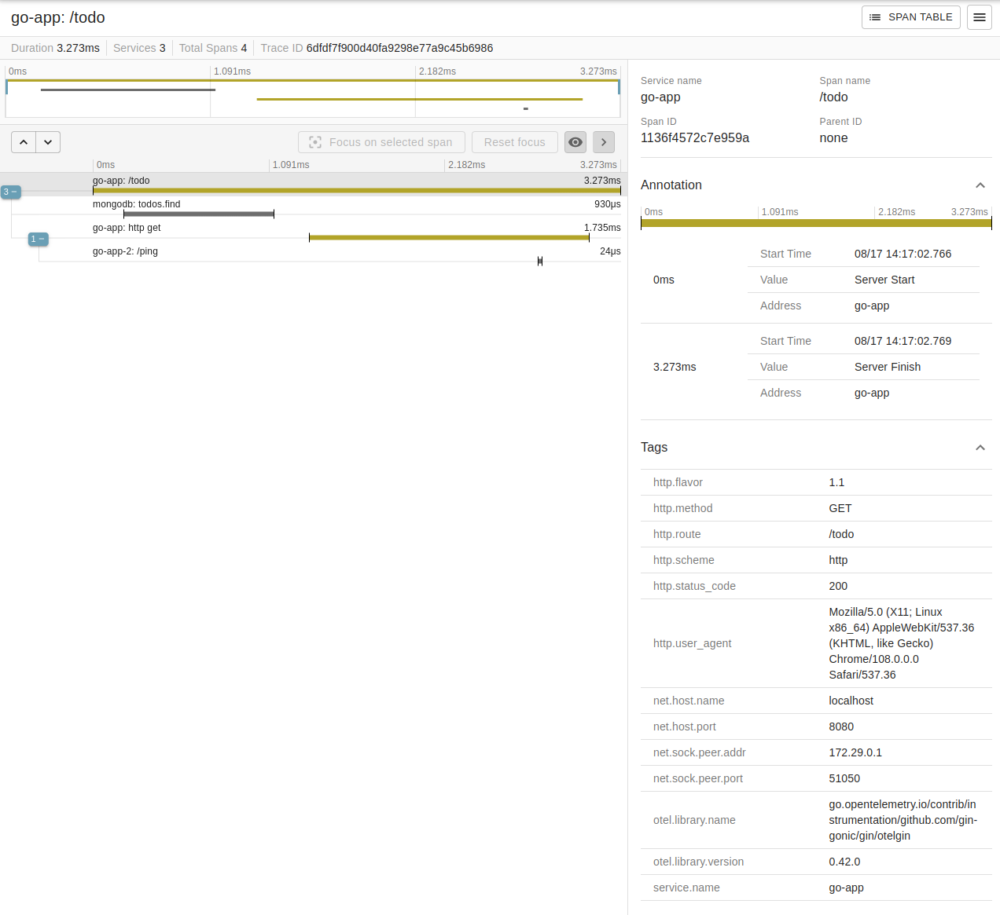

<h1 align="center">
  </img> Opentelemetry
</h1>

    </img>
    <a href="https://github.com/marcelobiao/poc-opentelemetry/blob/master/LICENSE.md">
        </img>
    </a>

  

## :gear: Tecnologias

Esse projeto foi desenvolvido com as seguintes tecnologias:

- [OpenTelemetry](https://opentelemetry.io/)
- [Zipkin](https://zipkin.io/)
- [Jaeger](https://www.jaegertracing.io/)

## :computer: Sobre

Projeto desenvolvido com o propósito de aprofundar meu entendimento e adquirir conhecimento sobre as ferramentas de tracing disponíveis no mercado

## :memo: Licença

Esse projeto está sob a licença MIT. Veja o arquivo [LICENSE](LICENSE.md) para mais detalhes.

## :phone: Contato

Para dúvidas ou sugestões, as issues e pull requestes são sempre bem vindos, ou me envie uma mensagem pelo Discord (MarceloBiao#6673) para que possamos conversar :grin:.